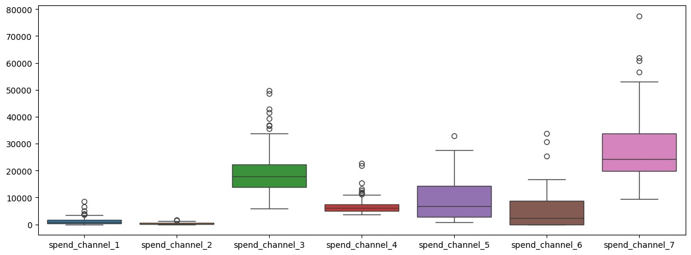
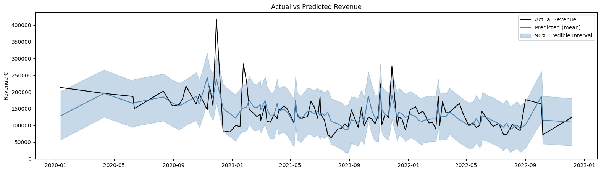
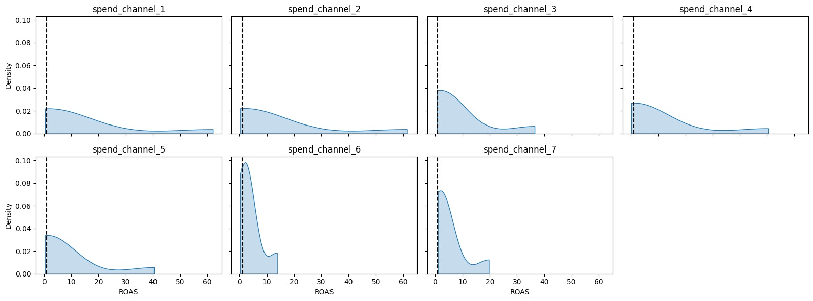
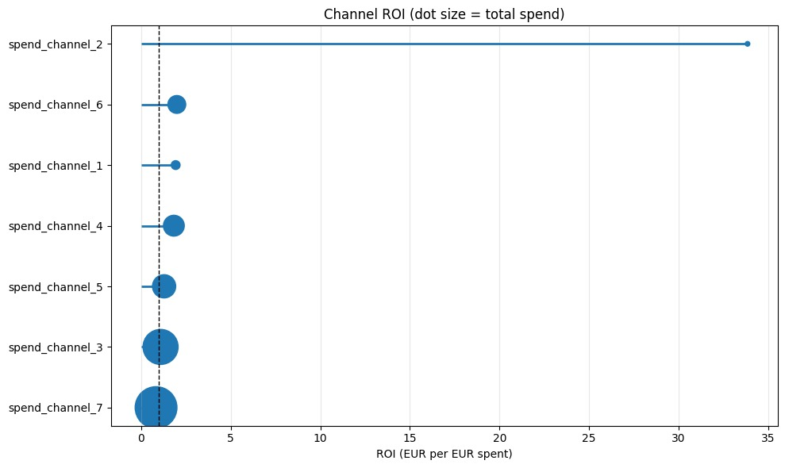
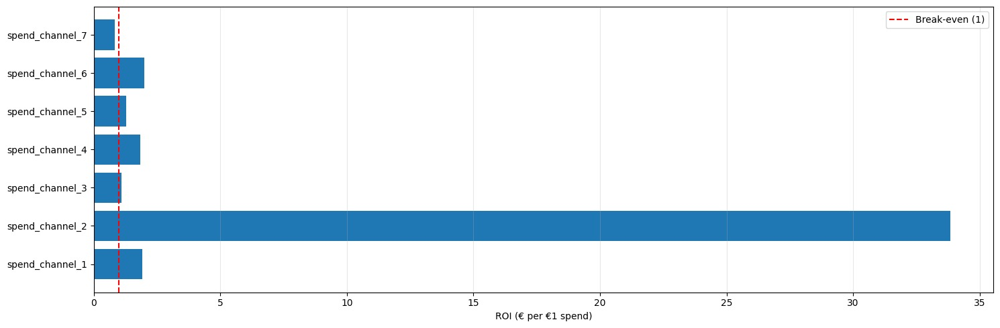

# Bayesian Marketing Mix Model (MMM)

A Bayesian MMM built with PyMC to measure the revenue contribution and ROI of 7 marketing spend channels across a two-year weekly dataset (August 2020 to August 2022). The model incorporates adstock transformation for carry-over effects, Fourier seasonality, and a time trend, with all parameters estimated via MCMC sampling.

## Data

The dataset covers weekly marketing spend across 7 channels and corresponding weekly revenue. Channel spend varies significantly in scale -- channels 3 and 7 have the largest budgets while channel 2 has the lowest total spend at 35k EUR.



---

## Model

The model decomposes weekly revenue into a baseline intercept, per-channel adstock-transformed spend contributions, a linear time trend, and Fourier seasonality terms.

**Adstock transformation** accounts for carry-over using the recursive decay formula:

```
adstock[t] = spend[t] + alpha * adstock[t-1]
```

`alpha` is estimated independently per channel with a `Beta(2, 2)` prior, placing no strong assumption on decay speed and letting the data decide. Posterior alpha estimates ranged from 0.25 to 0.42, indicating fast-to-moderate decay across all channels.

All priors were chosen iteratively via prior predictive checks and adjusted until predicted revenue fell within a plausible range.

| Parameter | Prior | Reasoning |
|---|---|---|
| Intercept | Normal(0.3, 0.1) | Captures baseline revenue with no marketing activity. Sigma tightened from 0.5 after prior predictive checking. |
| Channel coefficients (beta_channel) | HalfNormal(sigma=0.14) | HalfNormal because spend cannot causally destroy revenue. Sigma selected iteratively after wider priors produced predictions far above the observed maximum of 418k EUR. |
| Adstock decay (alpha) | Beta(2, 2) | No strong assumption on decay direction; data-driven. |
| Trend (beta_trend) | Normal(0, 0.15) | Allows positive or negative trend since business direction over the period was unknown at modelling time. |
| Fourier seasonality (gamma_fourier) | Laplace(0, 0.2) | Keeps most coefficients near zero by default; safer choice given only two years of data to avoid fitting noise as seasonal pattern. |
| Observation noise (sigma_obs) | HalfNormal(0.1) | Tightened after prior predictive checks to prevent the model from hiding poor fit behind a large noise term. |

---

## Results

**Convergence**

R-hat of 1.0 and minimum ESS of 1059 confirm the model sampled correctly and results are reliable (thresholds follow Vehtari et al. 2021).

**Fit**

| Metric | Value |
|---|---|
| R-squared | 0.42 |
| MAPE | 20.6% |
| RMSE | 38,507 EUR |

The model captures the general trend and most weeks fall within the 90% credible interval. Fit is moderate and reasonable.



**Channel effects**

All 7 channels show a positive effect on revenue with `p(>0) = 1.0`. Channels 6 and 7 have the highest beta coefficients (0.106 and 0.110), indicating the strongest direct impact per unit of spend. Channels 1 and 2 have the highest adstock alpha values (0.42 and 0.41), meaning their effects linger longest. The trend coefficient is negative (-0.131), confirming baseline revenue declined over the period. Fourier seasonality coefficients are all close to zero, suggesting no strong seasonal pattern.

**ROI per channel**

ROI was estimated by dividing each channel's total attributed revenue by its total spend, using posterior mean beta and adstock values.

| Channel | ROI (EUR per EUR 1 spent) | Note |
|---|---|---|
| Channel 6 | 1.99 | Best channel -- good ROI and concentrated ROAS posterior |
| Channel 1 | 1.93 | Good ROI but wide ROAS posterior |
| Channel 4 | 1.83 | Good ROI and more reliable than channel 1 |
| Channel 5 | 1.28 | Marginal but above break-even |
| Channel 3 | 1.09 | Barely breaks even despite high spend |
| Channel 7 | 0.83 | Below break-even despite highest spend |
| Channel 2 | 33.85 | Unreliable -- total spend only 35k EUR, ROAS posterior very wide |

Channel 2's ROI is not a genuine signal. Channels 3 and 7 received the largest budgets yet are at or below break-even. Note that the model does not account for saturation effects, so these ROI estimates alone should not be used to recommend budget reallocation.







### Project Instructions: 

To run the project

with uv : 

1. Install uv ( https://docs.astral.sh/uv/ )
2. run `uv run jupyter lab` 


with requirements txt

1. activate a venv
2. `pip install -r requriements.txt`